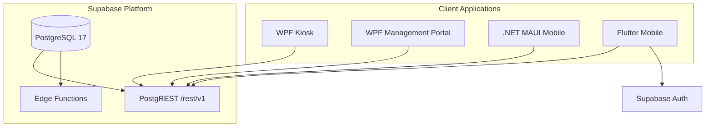
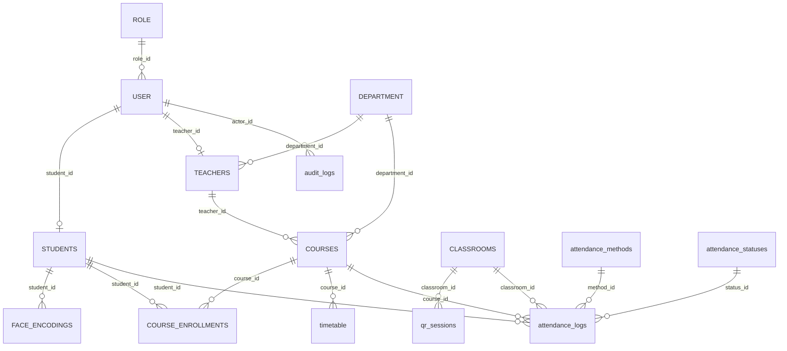
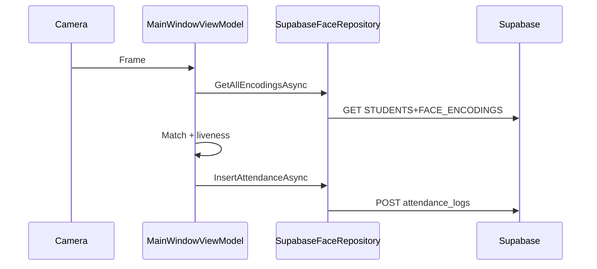
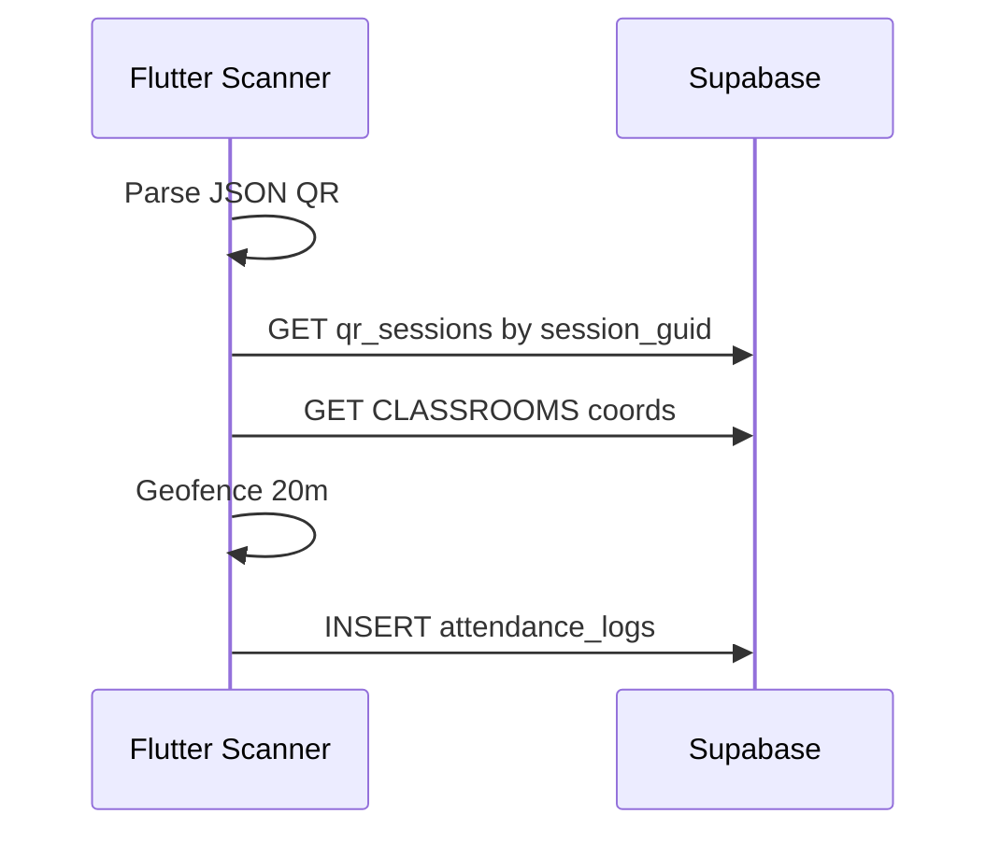
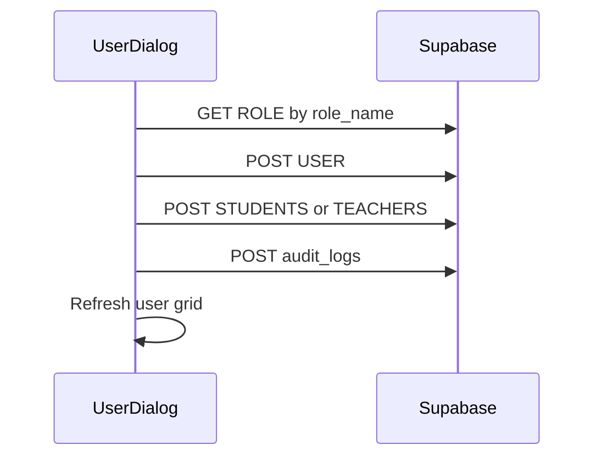

# FacePass — Project Context (Senior Architecture Reference)

**Version:** Schema migration baseline (14+ tables, May 2026)  
**Backend:** Supabase (PostgreSQL + PostgREST + optional Edge Functions)  
**Clients:** WPF Kiosk, WPF Management Portal, .NET MAUI Mobile, Flutter Mobile  

This document is the single architectural source of truth for engineers onboarding after the database normalization. It describes *what* the system is, *how* components interact, and *where* every persistence operation occurs.

---

## 1. Executive Summary

FacePass is a **university biometric attendance platform**. Students mark attendance via **face recognition** (classroom kiosk), **QR scan** (mobile, geofenced), or **GPS proximity** (background auto-absence). Teachers and administrators use a **Management Portal** to manage users, courses, timetables, and live attendance. All clients share one **Supabase PostgreSQL** database exposed through the **PostgREST** API.

The system recently migrated from a denormalized legacy schema (`users`, `students`, `courses`, `classes`, string `method`/`status` columns) to a **3NF schema** with uppercase core entity tables, lookup tables for attendance method/status, and **bigint** surrogate keys (no GUIDs for domain entities).

---

## 2. Business Capabilities

| Capability | Primary actor | Channel |
|------------|---------------|---------|
| Face check-in | Student | Kiosk (camera + liveness) |
| QR check-in | Student | Flutter / MAUI mobile |
| GPS absence detection | Student | Flutter (background timer) |
| User & role administration | Admin | Management Portal |
| Course / enrollment assignment | Admin | Management Portal |
| Timetable management | Admin | Management Portal |
| Live lecture attendance view | Teacher | Management Portal |
| Roster & biometric status | Teacher | Management Portal |
| Audit trail | System | `audit_logs` on admin actions |

---

## 3. System Context (C4 Level 1)



**Integration rule:** Every REST call must send **both** headers:

- `apikey: <SUPABASE_ANON_KEY>`
- `Authorization: Bearer <SUPABASE_ANON_KEY>`

(Kiosk `SupabaseService` and Management `SupabaseRestClient` enforce this.)

---

## 4. Solution Architecture by Module

### 4.1 Kiosk (`Kiosk/`)

**Purpose:** Fixed classroom station — live camera, face match against enrolled encodings, liveness challenge, attendance logging, rotating QR for mobile backup.

| Component | Responsibility |
|-----------|----------------|
| `SupabaseService` | HTTP client with apikey + Bearer |
| `SupabaseFaceRepository` | `STUDENTS`, `FACE_ENCODINGS`, `attendance_logs`, `qr_sessions` |
| `QrSessionService` | Inserts QR session; encodes JSON `{ session_guid, classroom_id, expires_at }` |
| `AttendanceService` | Thin wrapper over attendance insert |
| `MainWindowViewModel` | Pipeline: detect → encode → match → liveness → log |

**Config (`appsettings.json`):**

```json
"Kiosk": { "ClassroomId": 1, "CourseId": 1 }
```

IDs are **bigint integers**, not GUIDs.

**Database operations:**

| Operation | Method | Endpoint / table |
|-----------|--------|------------------|
| Load face gallery | GET | `/rest/v1/STUDENTS?select=student_id,FACE_ENCODINGS(vector_data_bytea)` |
| Student display name | GET | `/rest/v1/STUDENTS?student_id=eq.{id}&select=USER(first_name,last_name)` |
| Log attendance | POST | `/rest/v1/attendance_logs` — `method_id`, `status_id`, `course_id` |
| Create QR session | POST | `/rest/v1/qr_sessions` |

**Attendance mapping (in code):**

- Methods: face=1, qr=2, manual=3, gps_auto=4  
- Statuses: present=1, suspicious=2, manual_override=3, absent=4  

---

### 4.2 Management Portal (`Management/`)

**Purpose:** Admin and teacher desktop app (WPF). Custom login against `"USER"` (BCrypt), not Supabase Auth (except hardcoded `admin@facepass.com` bypass).

| View / Service | DB access |
|----------------|-----------|
| `AuthService` | GET `USER` + embed `ROLE(role_name)` |
| `AdminDashboard` | CRUD `USER`; read `audit_logs`, `timetable` |
| `UserDialog` | POST/PATCH `USER`; resolve `role_id` from `ROLE`; create `STUDENTS`/`TEACHERS` row; audit |
| `StudentAssignmentDialog` | POST `COURSE_ENROLLMENTS` |
| `TeacherAssignmentDialog` | PATCH `COURSES.teacher_id` |
| `StudentsView` | `COURSES` → `COURSE_ENROLLMENTS` → `FACE_ENCODINGS` |
| `TimetableView` / `TimetableDialog` | `timetable`, `COURSES` |
| `CurrentView` | `timetable`, `attendance_logs`, `CLASSROOMS` |

**Shared infrastructure:**

- `SupabaseRestClient` — URL, anon key, `Create()` / `Configure()`  
- `JsonEmbedHelper` — safe parsing of PostgREST embeds (`ROLE`, `COURSES`, `USER`, nested paths)

**Identity model:**

- `long userId` everywhere (was `Guid`)  
- Flattened UI fields: `name`, `role`, `id` added to `JObject` rows for DataGrid binding  

---

### 4.3 .NET MAUI Mobile (`Mobile/`)

**Purpose:** Student mobile (QR scan, dashboard). Uses `SupabaseMobileService` with Bearer + apikey.

| File | DB access |
|------|-----------|
| `SupabaseMobileService` | `attendance_logs` read/write; embeds `COURSES`, `CLASSROOMS` |
| `ScannerPage` | QR JSON `session_guid`; `LogAttendance` |
| `DashboardPage` | Stats + history (placeholder `studentId = 1` — needs auth wiring) |
| `DisputePage` | PATCH `attendance_logs` by `log_id` |

**Note:** `MauiProgram.cs` should use the same Supabase URL/key as other projects (configured in repo).

---

### 4.4 Flutter Mobile (`Mobile_Flutter/`)

**Purpose:** Primary student app — Supabase Auth login, dashboard, QR scanner, GPS tracking, profile.

| File | DB access |
|------|-----------|
| `supabase_service.dart` | `USER`, `STUDENTS`, `COURSE_ENROLLMENTS`, `attendance_logs` |
| `scanner_page.dart` | `qr_sessions`, `CLASSROOMS`, `COURSE_ENROLLMENTS`, insert log |
| `gps_tracking_service.dart` | `timetable`, `CLASSROOMS`, insert absent log |
| `dashboard_page.dart` | Resolves `user_id` via `USER.email`; loads enrollments |

**Utilities:** `lib/utils/json_embed.dart` — safe embed field access (mirrors C# `JsonEmbedHelper`).

**QR payload (must match Kiosk):**

```json
{
  "session_guid": "<uuid>",
  "classroom_id": "1",
  "expires_at": "2026-05-23T12:00:00.0000000Z"
}
```

**Geofence:** 20 meters (classroom `latitude` / `longitude` on `CLASSROOMS`).

---

### 4.5 Backend (`Backend/Functions/`)

| Function | DB |
|----------|-----|
| `notify-attendance/index.ts` | Webhook on `attendance_logs` INSERT (FCM placeholder) |

---

### 4.6 Shared (`Shared/`)

| File | DB |
|------|-----|
| `BiometricUtility.cs` | BYTEA float serialization (no direct SQL) |
| `StorageService.cs` | File/storage only |

---

## 5. Data Architecture

### 5.1 Table naming convention (PostgREST)

| Convention | Tables |
|------------|--------|
| **UPPERCASE quoted** | `"USER"`, `"ROLE"`, `"STUDENTS"`, `"TEACHERS"`, `"DEPARTMENT"`, `"COURSES"`, `"COURSE_ENROLLMENTS"`, `"BUILDINGS"`, `"CLASSROOMS"`, `"FACE_ENCODINGS"` |
| **lowercase** | `attendance_logs`, `attendance_methods`, `attendance_statuses`, `qr_sessions`, `timetable`, `audit_logs` |

REST paths must match **exact casing** (e.g. `/rest/v1/USER`, not `/users`).

### 5.2 Core entities (logical model)



### 5.3 Lookup seeds (required before FK inserts)

| Table | IDs | Values |
|-------|-----|--------|
| `ROLE` | 1–3 | admin, teacher, student |
| `attendance_methods` | 1–4 | face, qr, manual, gps_auto |
| `attendance_statuses` | 1–4 | present, suspicious, manual_override, absent |

Script: `Database/seed_lookup_tables.sql`

### 5.4 Important column rules

- **No `name` on `USER`** — use `first_name` + `last_name`  
- **No `name` on `COURSES`** — use `course_name`  
- **`attendance_logs`** — use `method_id` / `status_id`, not strings; **`course_id` required**  
- **`timetable.day_of_week`** — text (`Monday`, …), not integer weekday  
- **QR identity** — `session_guid` (uuid) in payload, not `session_id`  
- **`student_id`** — typically equals `USER.user_id` for 1:1 student accounts  

---

## 6. Complete Database Touchpoint Matrix

| # | Project | File | Op | Table(s) |
|---|---------|------|-----|----------|
| 1 | Kiosk | `SupabaseFaceRepository.cs` | R | `STUDENTS`, `FACE_ENCODINGS` |
| 2 | Kiosk | `SupabaseFaceRepository.cs` | R | `STUDENTS` + `USER` |
| 3 | Kiosk | `SupabaseFaceRepository.cs` | C | `attendance_logs` |
| 4 | Kiosk | `SupabaseFaceRepository.cs` | C | `qr_sessions` |
| 5 | Management | `AuthService.cs` | R | `USER`, `ROLE` |
| 6 | Management | `AdminDashboard.xaml.cs` | RUD | `USER`, `audit_logs`, `timetable` |
| 7 | Management | `UserDialog.xaml.cs` | CRU | `USER`, `ROLE`, `STUDENTS`, `TEACHERS`, `DEPARTMENT`, `audit_logs` |
| 8 | Management | `StudentAssignmentDialog.xaml.cs` | RC | `COURSES`, `STUDENTS`, `COURSE_ENROLLMENTS`, `audit_logs` |
| 9 | Management | `TeacherAssignmentDialog.xaml.cs` | RU | `COURSES` |
| 10 | Management | `StudentsView.xaml.cs` | R | `COURSES`, `COURSE_ENROLLMENTS`, `STUDENTS`, `USER`, `FACE_ENCODINGS` |
| 11 | Management | `TimetableView.xaml.cs` | R | `timetable`, `COURSES` |
| 12 | Management | `TimetableDialog.xaml.cs` | CRU | `COURSES`, `timetable` |
| 13 | Management | `CurrentView.xaml.cs` | R | `CLASSROOMS`, `timetable`, `attendance_logs`, `STUDENTS`, `USER` |
| 14 | MAUI | `SupabaseMobileService.cs` | RU | `attendance_logs`, `COURSES`, `CLASSROOMS` |
| 15 | MAUI | `ScannerPage.xaml.cs` | C | `attendance_logs` (via service) |
| 16 | Flutter | `supabase_service.dart` | RU | `USER`, `STUDENTS`, `COURSE_ENROLLMENTS`, `attendance_logs`, `COURSES` |
| 17 | Flutter | `scanner_page.dart` | R/C | `qr_sessions`, `CLASSROOMS`, `USER`, `STUDENTS`, `COURSE_ENROLLMENTS`, `attendance_logs` |
| 18 | Flutter | `gps_tracking_service.dart` | R/C | `timetable`, `CLASSROOMS`, `attendance_logs` |
| 19 | Flutter | `dashboard_page.dart` | R | `USER`, `COURSE_ENROLLMENTS` |

---

## 7. Security Architecture

### 7.1 Authentication models (two tracks)

| Client | Auth mechanism |
|--------|----------------|
| Management | Custom: GET `USER` by email + BCrypt `password_hash`; hardcoded admin shortcut |
| Flutter | Supabase Auth (`signInWithPassword`) + lookup `USER` by email for `student_id` |
| Kiosk | Anon key only (trusted device) |
| MAUI | Anon key (student id still placeholder) |

### 7.2 Row Level Security (RLS)

All core tables have **RLS enabled**. Without policies, PostgREST returns errors such as:

- `42501` — policy violation  
- `23503` — FK missing (e.g. empty `ROLE` table)  

**Development policy pack (run once):**

1. `Database/seed_lookup_tables.sql`  
2. `Database/rls_policies_development.sql`  

The development pack grants the `anon` role **broad CRUD** on application tables so desktop/mobile clients (using the anon key) can function without Supabase Auth JWT claims.

**Production direction:** Replace `dev_anon_*` policies with:

- Teachers: scoped SELECT/INSERT on their `course_id` rows  
- Students: SELECT own `attendance_logs`, INSERT own attendance  
- Admins: service-role or authenticated JWT with `role` claim  

Never ship the **service_role** key in client binaries.

### 7.3 PostgREST embed parsing

Joined resources (`ROLE`, `COURSES`, `STUDENTS(USER(...))`) may arrive as **object, array, or null**. Always use `JsonEmbedHelper` (C#) or `JsonEmbed` (Dart) — never chain `?["child"]` on a possible `JValue`.

---

## 8. Key Runtime Flows

### 8.1 Kiosk face attendance



### 8.2 Mobile QR attendance



### 8.3 Admin create user



---

## 9. Operational Runbook

### 9.1 New Supabase project setup (order matters)

```text
1. Apply SQL schema (CREATE TABLE …) from your migration scripts
2. Run Database/seed_lookup_tables.sql
3. Run Database/rls_policies_development.sql
4. Insert at least one BUILDINGS / CLASSROOMS row (with latitude, longitude)
5. Insert sample COURSES + timetable rows for testing
6. Configure client keys:
   - Kiosk/appsettings.json → ClassroomId, CourseId
   - Management/LoginWindow → or move to appsettings
   - Mobile_Flutter/lib/main.dart → Supabase.initialize
7. Create admin via portal OR seed USER with BCrypt hash
```

### 9.2 Common errors

| Symptom | Cause | Fix |
|---------|-------|-----|
| 401 + RLS message | Missing policy | Run `rls_policies_development.sql` |
| 23503 `user_role_id_fkey` | Empty `ROLE` | Run `seed_lookup_tables.sql` |
| JValue child error | Unsafe JSON embed | Use `JsonEmbedHelper` / `JsonEmbed` |
| QR invalid | Payload uses `session_id` not `session_guid` | Update Kiosk + mobile |
| Empty student list | No `COURSE_ENROLLMENTS` | Assign courses in Management |

---

## 10. Technology Stack

| Layer | Technology |
|-------|------------|
| Kiosk / Management | .NET 8, WPF, Emgu CV, Newtonsoft.Json |
| MAUI | .NET 8, ZXing.Net.Maui, Geolocator |
| Flutter | Dart 3, supabase_flutter, mobile_scanner, geolocator |
| Database | PostgreSQL 17 (Supabase) |
| PDF (Management) | iText — `ReportService.cs` (local only, no DB) |

---

## 11. Technical Debt & Hardening Backlog

1. **Management auth** — Move credentials to `appsettings.json`; remove duplicated anon keys.  
2. **MAUI student identity** — Replace `studentId = 1` with `USER` lookup by session/email.  
3. **Supabase Auth alignment** — Link `auth.users` to `"USER".user_id` or migrate Management to Auth.  
4. **Production RLS** — Remove `dev_anon_*` permissive policies.  
5. **Schema fixes** — `USER.role_id` as bigint; `TEACHERS.department_id` type alignment; FK on `attendance_logs.student_id`.  
6. **CLASSROOMS GPS** — Ensure `latitude`/`longitude` populated for geofencing.  
7. **Flutter login** — After Auth sign-in, consistently resolve `student_id` from `USER` table.  
8. **Edge function** — Wire `notify-attendance` to FCM device tokens table (not yet in schema).  

---

## 12. Repository Layout

```text
FacePass/
├── Kiosk/                 # WPF biometric station
├── Management/            # WPF admin + teacher portal
├── Mobile/                # .NET MAUI student app
├── Mobile_Flutter/        # Flutter student app (primary mobile)
├── Shared/                # Cross-cutting utilities
├── Database/
│   ├── seed_lookup_tables.sql
│   ├── rls_policies_development.sql
│   └── Triggers/
├── Backend/Functions/     # Supabase Edge Functions
└── Docs/
    └── project_context.md # This file
```

---

## 13. Document Maintenance

Update this file when:

- New tables or columns are added to Supabase  
- A client gains a new REST endpoint  
- Authentication or RLS strategy changes for production  
- QR / attendance payload contracts change  

**Related artifacts:** `db_schema_new.json` (machine-readable schema snapshot), `Docs/Deployment/Backend_Supabase_Deployment.md` (deployment notes).

---

*End of project context.*
